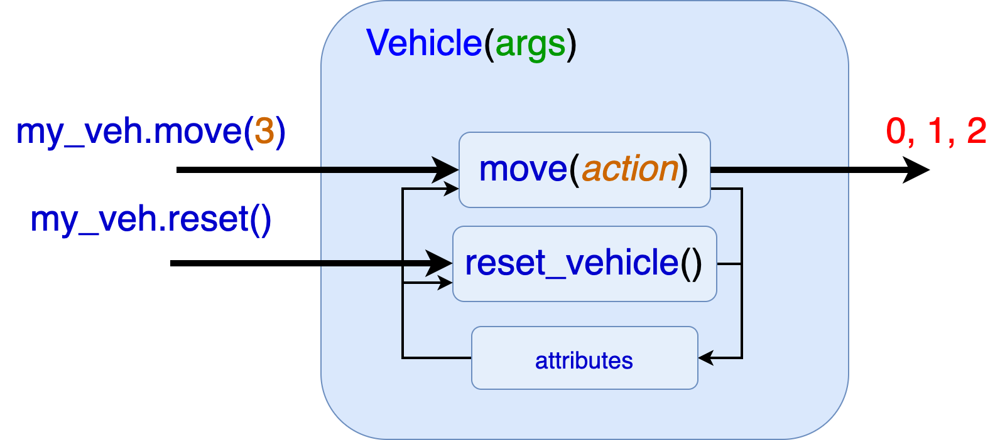
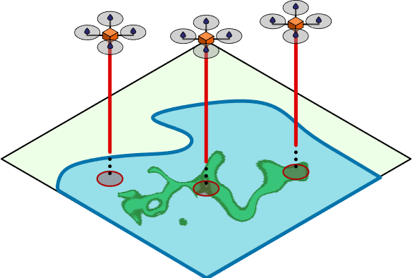

# Deep Reinforcement Learning - CFP 2022
Taller de DRL ara el curso Machine Learning: Aplicaciones del CFP de la U. de Sevilla.


## Instrucciones de instalación
1) Para poder ejecutar los scripts de entrenamiento, necesitamos instalar primero PyTorch (bilioteca similar a TensorFlow):

    (Sin GPU)
    ```
    conda install pytorch torchvision torchaudio -c pytorch

    ```
    (Con GPU)  
    ```
    conda install pytorch torchvision torchaudio -c pytorch
    ```

2) Ahora instalaremos las biblioteca _Stable Baselines 3_:
    ```
    pip install stable-baselines3[extra]
    ```

3) ¡Listo!

---
## 1) Primeros pasos: El escenario y el estado:

1.1) Tenemos que entender la clase _Vehicle_:



La clase Vehicle tiene dos métodos: *move*, que sirve para actualizar la posición en el mapa y *reset_vehicle*, para reiniciar el vehículo. 

1.2) Preparamos y entendemos el escenario mono-agent

El escenario de patrullaje que tenemos se llama SingleAgentEnvironment. Es una subclase de _gym.Env_, por lo que debe implementar todos
sus métodos abstractos (_step, reset, render, etc_):

- _step(action) -> state, reward, done, info_: El método _step_ recibe una acción y devuelve el estado siguiente (s'), la recompensa de esa acción, un bool que indica si ha terminado la misión (done) y un diccionario con información extra.

- _reset() -> state_: El método _reset_, resetea el escenario y al agente y devuelve el estado inicial.

